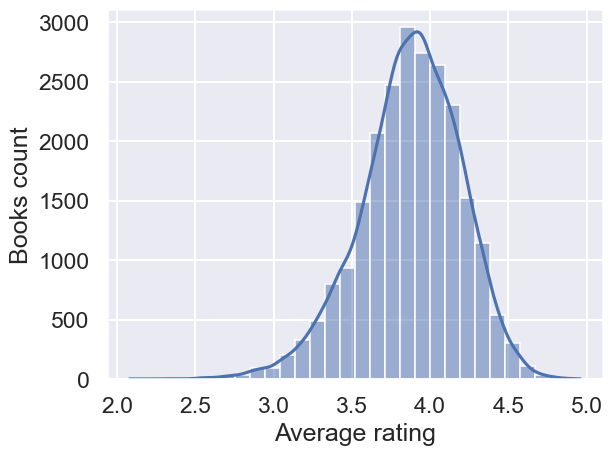
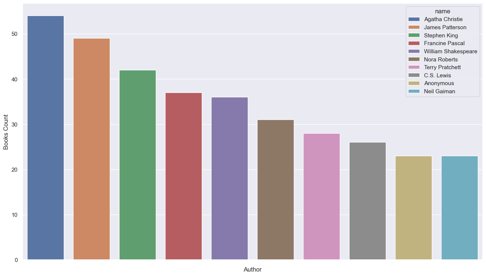
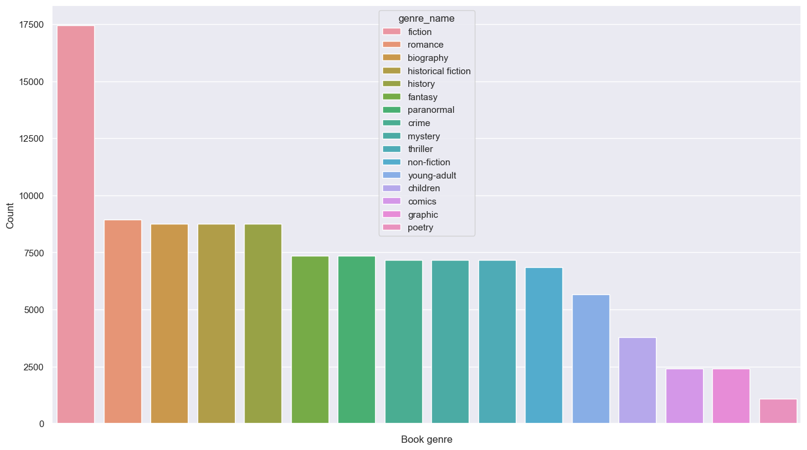
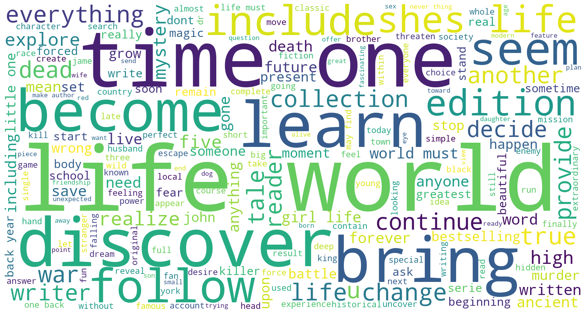
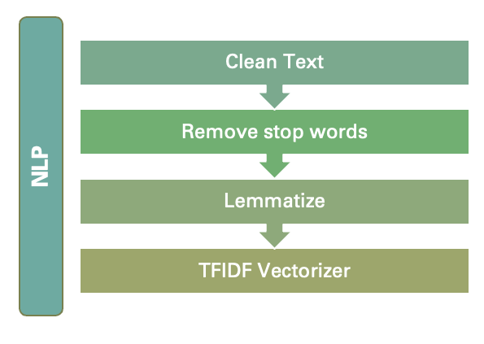
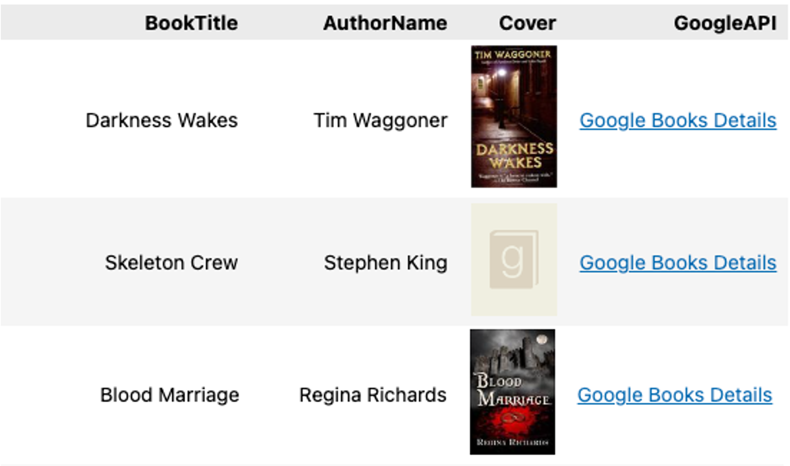
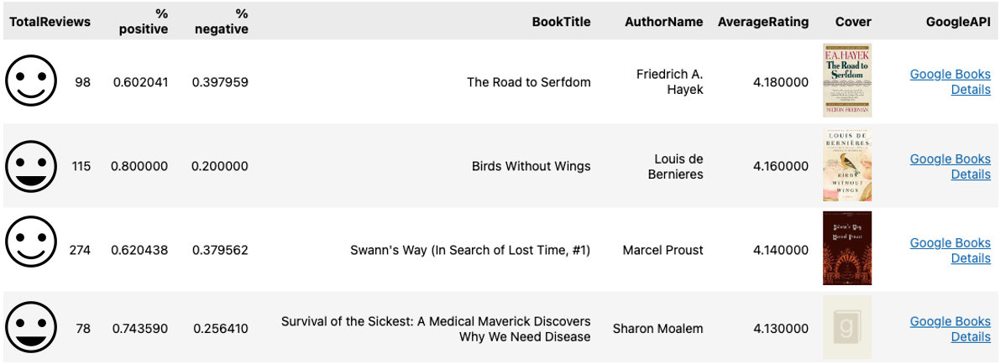

# Book Recommender

This project was created as the final project for my Data Science Bootcamp in Lighthouse Labs.

The dataset used was Goodreads json data extracted by the University of  California San Diego[(UCSD)](https://sites.google.com/eng.ucsd.edu/ucsdbookgraph/home?authuser=0).

The main goal of this project is to improve my knowledge related to:
- Recommenders
- Natural Language Processing (NLP)
- Sentiment Analysis
- APIs

## Project Workflow
**1. Data Wrangling**
- Extracted data from json file
- Created function to take random data sample and clean for processing.
For more details go to this [notebook](src/data_loading.ipynb).

**2. Exploratory Data Analysis**

> Note: I took a sample of 5% of the dataset due to processing limitations.

- In average the books in my sample had a rating of 4 stars.

- Top 10 authors.

- Book's genre distribution

**3. Data Cleaning**

During the datacleaning process I created functions to clean the sample. These functions will handle all the new samples created, without having to code every time.

The functions created cover: 
- Remove spaces
- Clean special characters
- Remove stop words from comments and descriptions
- Lemmatize text

*Most frequent words on the Book's description*

For more details go to the data cleaning [notebook](src/data_cleaning.ipynb).

**4. Feature Engineering**
- Created a list of genres
- Used book's desription to create a keywords list
- Created a corpus based on the book description and book genres

For more details go to the feature engineering [notebook](src/feature_engineering_and_modeling_f.ipynb).

**5. Methods used**

- Cosine of similarity for keywords and corpus
- Calculation of Kmeans with user rating
- Use of SVD for predicting user rating
- Added sentiment analysis for suggested books based on reviews text
- Added Google Books API to bring a link for more information.

For more details go to this [notebook](src/feature_engineering_and_modeling_f.ipynb).

## Results
- Recommender based on book corpus and keywords.

- Recommender based on reviews (collaborative).

> The book used for recommendation was Doctor Sleep by Stephen King

## Further Development
- Deployment
- Explore more options for recommenders and optimize
- Add Amazon Product Advertising API to offer a purchase option

## Acknowledgements

- Mengting Wan, Julian McAuley, "[Item Recommendation on Monotonic Behavior Chains](https://www.google.com/url?q=https%3A%2F%2Fgithub.com%2FMengtingWan%2Fmengtingwan.github.io%2Fraw%2Fmaster%2Fpaper%2Frecsys18_mwan.pdf&sa=D&sntz=1&usg=AOvVaw0HcX6gU1ENhk7fbCXXbCiy)", in RecSys'18. [[bibtex](https://www.google.com/url?q=https%3A%2F%2Fdblp.uni-trier.de%2Frec%2Fbibtex%2Fconf%2Frecsys%2FWanM18&sa=D&sntz=1&usg=AOvVaw2VTBdVH0HOCFqZJ3u3NsgZ)]

- Mengting Wan, Rishabh Misra, Ndapa Nakashole, Julian McAuley, "[Fine-Grained Spoiler Detection from Large-Scale Review Corpora](https://www.google.com/url?q=https%3A%2F%2Fwww.aclweb.org%2Fanthology%2FP19-1248&sa=D&sntz=1&usg=AOvVaw1G1ZlQ7oe0NDtqeI8gN2Nf)", in ACL'19. [[bibtex](https://www.google.com/url?q=https%3A%2F%2Fdblp.uni-trier.de%2Frec%2Fbibtex%2Fconf%2Facl%2FWanMNM19&sa=D&sntz=1&usg=AOvVaw25f7_0XLwNzo6a9-Qa2jGv)]

